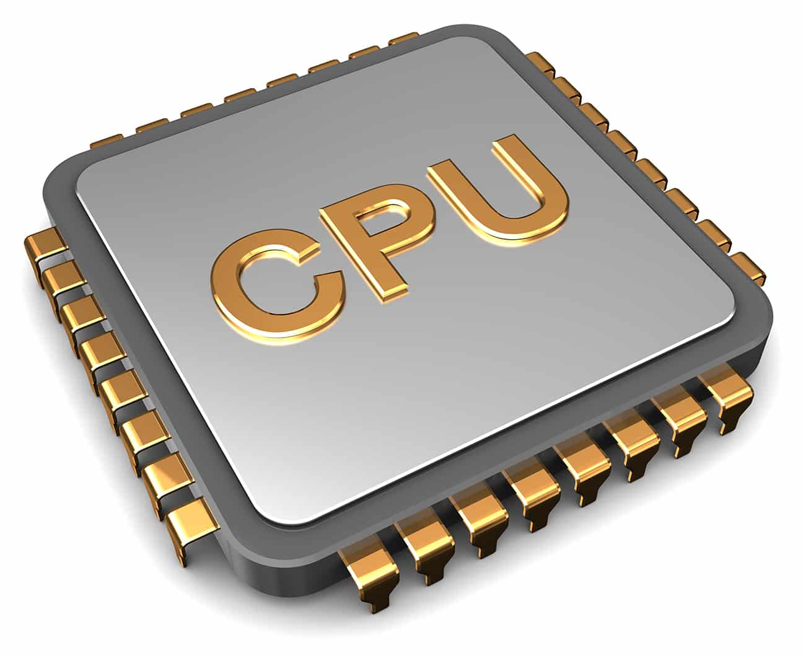
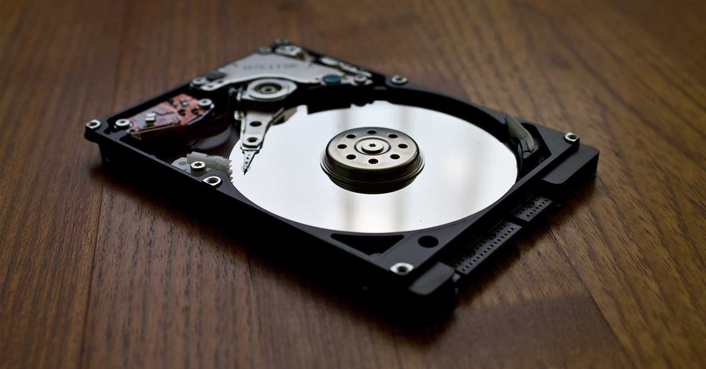

CONCEPTOS BASICOS

Azure: Es un servicio de computación en la nube creado por Microsoft para construir, probar, desplegar y administrar aplicaciones y servicios mediante el uso de sus centros de datos. Proporciona software como servicio (SaaS), plataforma como servicio (PaaS) e infraestructura como servicio (IaaS) y es compatible con muchos lenguajes, herramientas y marcos de programación diferentes, incluidos software y sistemas específicos de Microsoft y de terceros. 

**¿Qué es una computadora?**

una computadora es una máquina capaz de realizar operaciones y cálculos. No es ni más ni menos que una calculadora.

**procesador de una computadora**

El procesador o CPU (Central Processing Unit) es el cerebro de la computadora. Se encarga del intercambio de datos entre los componentes (RAM, disco duro, tarjeta gráfica).

Sus tareas principales son:

<ol>
<li>Leer los datos en la memoria</li>
<li>Procesar los datos</li>
<li>Escribir datos en la memoria</li>

</ol>

<strong>Disco duro</strong>

Su papel es almacenar los datos de la computadora. El disco duro contiene el sistema operativo como Windows, macOS o Linux (entre otros), los programas instalados y los datos personales del usuario.

Almacena información en forma binaria. Actualmente, son capaces de almacenar varios Tera bytes de datos (es decir, 1024 gigabytes), que corresponde a cientos de miles de fotografías, miles de películas, millones de documentos de texto

<ol>
<li>Los discos duros clásicos: contienen piezas mecánicas que incluyen una cabeza de lectura que apunta a los discos magnéticos y lee y escribe los datos.</li>
<li>Los discos duros SSD: sin una parte mecánica, leen los datos más rápidamente.</li>
<li>Los discos duros externos: para tener una copia de seguridad de la computadora y su disco duro interno.</li>

</ol> 

<strong>Placa madre</strong>

Es el componente principal de la unidad central. Centraliza y procesa los datos intercambiados dentro de la computadora usando el procesador. Maneja el disco duro, el teclado, el ratón, la red, los puertos USB...

Es el soporte en el que todos los componentes de una computadora están conectados.

